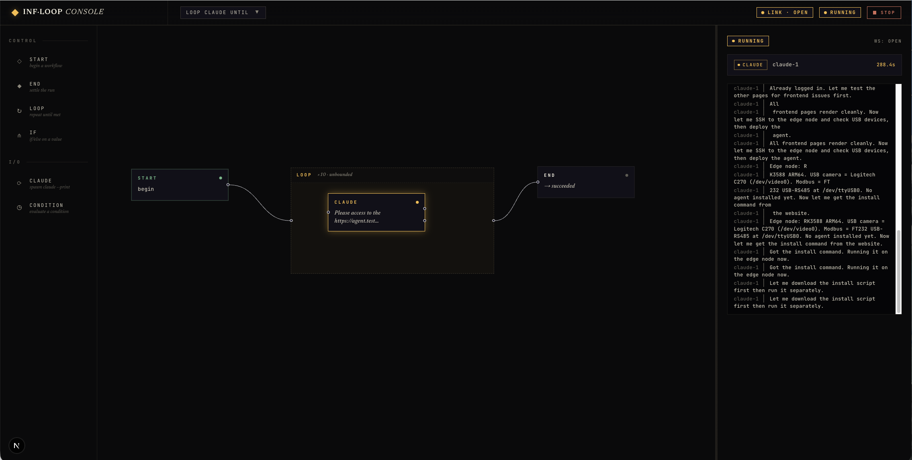

<h1 align="center">InfLoop</h1>

<p align="center">
  <em>Visual orchestration for AI agents — loop, branch, fan out, judge, and replay.</em>
</p>

<p align="center">
  <a href="#quickstart">Quickstart</a> •
  <a href="#core-concepts">Core concepts</a> •
  <a href="#how-infloop-is-different">Comparison</a> •
  <a href="#security-model">Security</a> •
  <a href="#status">Status</a> •
  <a href="#docs">Docs</a>
</p>

<p align="center">
  
  
  
  
  
  
</p>

<p align="center">
  
</p>

---

## What is InfLoop?

**InfLoop turns one-off AI agent calls into visible, repeatable, inspectable workflows.**

Claude Code, Codex, Hermes, and other agents are excellent at single tasks. Real work needs more: looping until something is done, branching on the output, checking the filesystem, fanning out to several agents, replaying yesterday's run to see what went wrong. Wiring that into shell scripts is painful and disappears the moment it runs.

InfLoop is a **local-first visual canvas** for that work. You compose agent workflows out of nodes — Agent, Loop, Branch, Parallel, Subworkflow, Judge, Script — and watch every token stream as the model generates it. Workflows are plain JSON files you can version in git, share with a teammate, and trigger from the UI, an MCP client, or a webhook.

## Why InfLoop

Agents in isolation are powerful but illegible. The moment you need *more than one call*, the gap shows up:

- A loop that stops "when the tests pass" turns into a brittle bash wrapper.
- A "run three prompts and pick the best" experiment becomes a tab full of copy-paste.
- An automation that should fire on a GitHub event ends up running by hand.
- Yesterday's successful run is gone — no transcript, no replay.

InfLoop fills that gap with one local app: a canvas to compose, a live console to watch, persisted history to replay, and three triggering surfaces (UI / MCP / webhook) so workflows can fire from wherever the work originates.

## Quickstart

**Requirements:** [Bun](https://bun.sh) ≥ 1.3. The default Claude provider needs the [Claude Code CLI](https://docs.anthropic.com/en/docs/claude-code) on your `PATH` (override with `INFLOOP_CLAUDE_BIN`). Other providers — Codex, Hermes, your own HTTP service — work too; see [docs/providers.md](docs/providers.md).

```bash
git clone https://github.com/rhoninl/Infinite-Loop.git
cd Infinite-Loop
bun install
bun run dev
```

**First run:**

1. Open <http://localhost:3000>.
2. The starter workflow loads automatically.
3. Click an **Agent** node and edit its `prompt` and `cwd` in the right panel.
4. Hit **Run** in the top bar.
5. Watch streaming tokens appear live in the right panel as the agent generates them.

Other scripts: `bun run test`, `bun run typecheck`, `bun run build`, `bun run start`.

## Core concepts

A workflow is a directed graph of typed nodes. Each node writes outputs into a flat scope keyed by node id; downstream nodes reference them with `{{node-id.field}}` templating.

| Node | What it does |
|---|---|
| **Agent** | Runs an agent through a provider (Claude, Codex, Hermes, your own). |
| **Loop** | Repeats its body until a `Condition` says stop, capped by `maxIterations`. |
| **Condition** | `sentinel` (text match), `command` (shell exit code), or `judge` (a second agent grades). |
| **Branch** | `lhs op rhs` predicate routing to `true` / `false` / `error`. |
| **Parallel** | Fans children out — `wait-all`, `race`, or `quorum:N`. |
| **Subworkflow** | Calls another workflow as a single step with isolated inputs and outputs. |
| **Judge** | Reads N candidates and picks a winner with structured scoring. |
| **Script** | Inline TypeScript (Bun) or Python (`python3`) with typed named inputs. |
| **Start / End** | Entry and exit. Start declares the workflow's caller-supplied `inputs`. |

Full reference (handles, output keys, JSON schema): [docs/workflow-format.md](docs/workflow-format.md).

### See it run

A real run logged as plain text:

```
run_started     Loop Claude until condition
node_started    loop-1
node_started    agent-1
agent-1 │ All frontend pages render cleanly. Now
agent-1 │ let me SSH to the edge node and check USB devices…
node_finished   agent-1 → next
node_started    cond-1
condition_checked  cond-1 met:Y matched at index 6
node_finished   cond-1 → met
run_finished    succeeded
```

## Examples — what you can build

- **Iterate until tests pass.** Loop an agent over a codebase with a `command` condition running `pytest -q`. Stops the moment ground truth says done.
- **Multi-agent debate.** Fan three prompts (idiomatic, contrarian, conservative) out to Claude in parallel; let a Judge node read all three and pick a winner. The shipped **Team** preset does exactly this — see `workflows/library/team.json`.
- **Self-grading drafts.** One agent drafts, a second grades against a rubric, loop until the grade clears a threshold.
- **GitHub-driven review.** A webhook trigger on `pull_request: opened` queues a review workflow that posts a comment back.
- **Agents calling InfLoop.** Expose your workflows as MCP tools so Claude Code, Cursor, Cline, or Zed can call them by name — they get discovery for free.

## How InfLoop is different

| Tool | Sweet spot | Where InfLoop fits |
|---|---|---|
| **Claude Code / Codex** | A great single-agent session | InfLoop coordinates repeatable, multi-step, multi-agent workflows on top of them |
| **n8n / Zapier** | SaaS automation between hosted apps | InfLoop is **local-first** and focused on **agent runners**, scripts, and CLIs |
| **LangGraph** | Code-defined agent graphs in Python | InfLoop is **visual**, **inspectable**, and **replayable** — no recompile to iterate |
| **Dify / Flowise** | LLM apps and chatbot flows | InfLoop targets **developer workflows** — CLIs, MCP, webhooks, filesystem checks |
| **OpenHands** | Autonomous coding tasks | InfLoop focuses on **orchestration**, **branching**, **replay**, and **external triggers** |

## Trigger surfaces

Three ways to start a workflow:

1. **Canvas** — click Run in the top bar. If the workflow declares inputs, a modal collects them.
2. **MCP** — every saved workflow is exposed as a tool at `POST /api/mcp`. Workflow tools enqueue (non-blocking) and return `{ queueId, position }`; poll with `inflooop_get_run_status`. See [docs/mcp.md](docs/mcp.md).
3. **Webhook** — wire up triggers visually in the Dispatch view. Generic JSON or GitHub events out of the box; drop a JSON file in `webhook-plugins/` to add more. See [docs/webhooks.md](docs/webhooks.md).

> The engine runs **one workflow at a time**. Additional MCP calls and webhook hits queue in FIFO order (cap 100); the `/queue` page shows pending items with per-item cancel.

## Security model

InfLoop runs **local agent CLIs, inline scripts, and shell commands** on your machine. Treat it like a local code-execution surface.

- **Default bind is `0.0.0.0`** for LAN convenience. Use `HOST=127.0.0.1` if you don't need it.
- **`INFLOOP_API_TOKEN`** gates the management/MCP API with a bearer token; setting it disables the browser UI (use for headless servers).
- **Webhook URLs are credentials.** The unguessable `triggerId` is the only auth — treat URLs like passwords and rotate via the Dispatch UI.
- **Workflow JSON files are executable code.** Review every workflow you import or download before running it. Same for files in `providers/`, `webhook-plugins/`, and `triggers/`.
- **Do not expose InfLoop directly to the public internet.** No rate limiting, no per-user auth, no audit log yet. Put it behind a Cloudflare Tunnel with Access policies, a Tailscale ACL, or a reverse proxy with HTTP auth.

Full details and recipes: [docs/security.md](docs/security.md).

## Status

**Shipped**

- Visual canvas with drag-and-drop, resize, undo/redo (`Cmd/Ctrl+Z`, `Cmd/Ctrl+Shift+Z`)
- Node types: Start, End, Agent, Condition (sentinel / command / judge), Loop, Branch
- Multi-agent primitives: Parallel, Subworkflow, Judge
- Script nodes (TypeScript via Bun, Python via `python3`)
- Pluggable provider manifests (CLI or HTTP)
- Live token streaming via SSE
- MCP endpoint (`POST /api/mcp`) — every workflow becomes a tool
- Webhook triggers with a visual Dispatch view (Generic + GitHub plugins)
- Run history persisted to `runs/<workflowId>/<runId>.json`, replayable with per-node cards
- Refresh-safe live state
- In-memory FIFO queue (cap 100) and `/queue` page with per-item cancel

**Planned**

- `Shell` node (run arbitrary commands as a first-class node)
- `SetVar` node (write a named variable into scope)
- `Catch` / error-handling subgraphs
- `HTTP` node (call REST endpoints without a Script wrapper)
- `Switch` node (multi-way branch)
- Predicate DSL with `&&` / `||` / `!`
- Webhook signature verification (GitHub HMAC, Stripe signing, …)
- Durable queue persistence across restarts

## Docs

- [MCP guide](docs/mcp.md)
- [Webhook guide](docs/webhooks.md)
- [Provider manifests](docs/providers.md)
- [Workflow JSON format & node reference](docs/workflow-format.md)
- [Configuration & environment variables](docs/configuration.md)
- [Architecture](docs/architecture.md)
- [Security model](docs/security.md)

## A note on naming

| Surface | Spelling |
|---|---|
| Product, UI, prose | **InfLoop** |
| GitHub repo path | `Infinite-Loop` |
| `package.json` name | `infloop` |
| MCP server identifier and tool prefix on the wire | `inflooop` (triple `o`, intentional — hardcoded in `app/api/mcp/route.ts`) |

If you write a script that talks to the MCP endpoint, the tools you'll list are `inflooop_get_run_status`, `inflooop_list_runs`, and so on — the `oo` is real.

## Contributing

Issues and PRs welcome. The codebase is small — a good way in is to read the original design at `docs/superpowers/specs/2026-04-28-workflow-dag-design.md` and the engine at `lib/server/workflow-engine.ts`.

## License

**License: TBD.** Do not use this project in production until a license is published. If you need clarity on use, open an issue.
